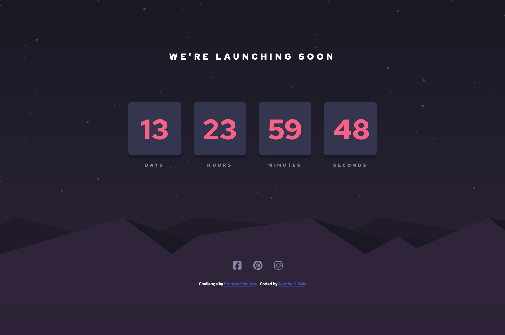
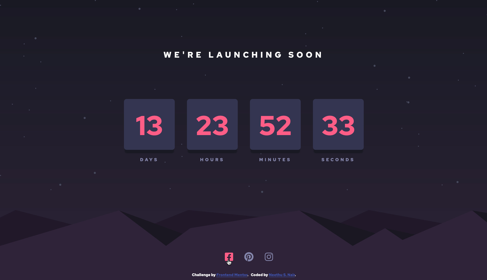

# Frontend Mentor - Launch countdown timer solution

This is a solution to the [Launch countdown timer challenge on Frontend Mentor](https://www.frontendmentor.io/challenges/launch-countdown-timer-N0XkGfyz-). Frontend Mentor challenges help you improve your coding skills by building realistic projects.

## Table of contents

- [Overview](#overview)
  - [The challenge](#the-challenge)
  - [Screenshot](#screenshot)
  - [Links](#links)
- [My process](#my-process)
  - [Built with](#built-with)
  - [What I learned](#what-i-learned)
  - [Continued development](#continued-development)
- [Author](#author)

## Overview

### The challenge

Users should be able to:

- See hover states for all interactive elements on the page
- See a live countdown timer that ticks down every second (start the count at 14 days)
- **Bonus**: When a number changes, make the card flip from the middle

### Screenshot

#### Desktop design

#### Mobile design

#### Active state

### Links

- Solution URL: [@nees101/FrontendMentor](https://www.frontendmentor.io/solutions/responsive-launch-down-timer-using-css-and-javascript-IWzQJmmdJ)
- Live Site URL: [@nees101/github](https://nees101.github.io/Launch-countdown-timer-main-challenge-solution/)

## My process

### Built with

- Semantic HTML5 markup
- CSS custom properties
- Flexbox
- Javascript

### Continued development
To make the card flip from the middle when a number change.

## Author

- Frontend Mentor - [@nees101](https://www.frontendmentor.io/profile/nees101)
- Github - [@nees101](https://www.github.com/nees101)
